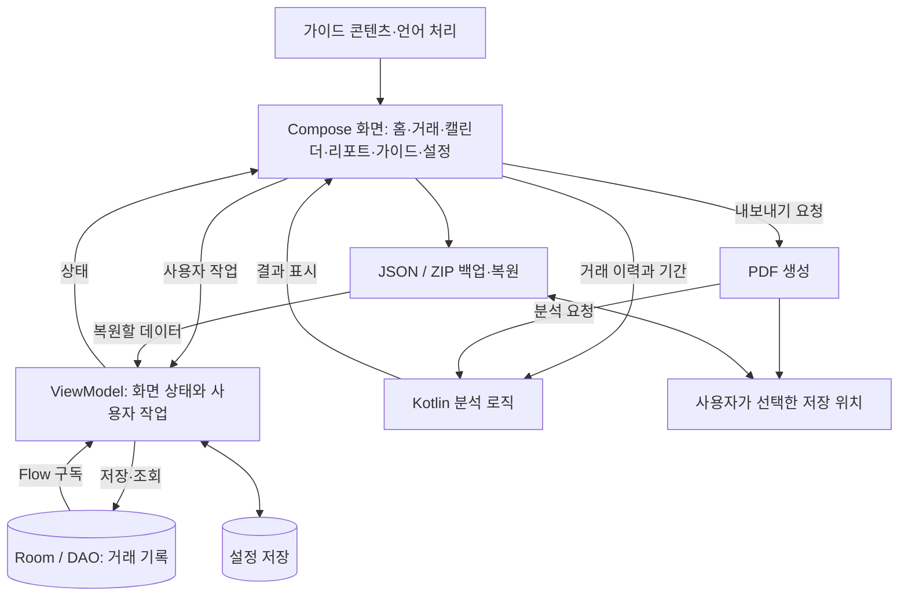
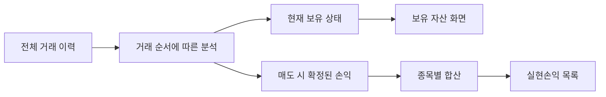
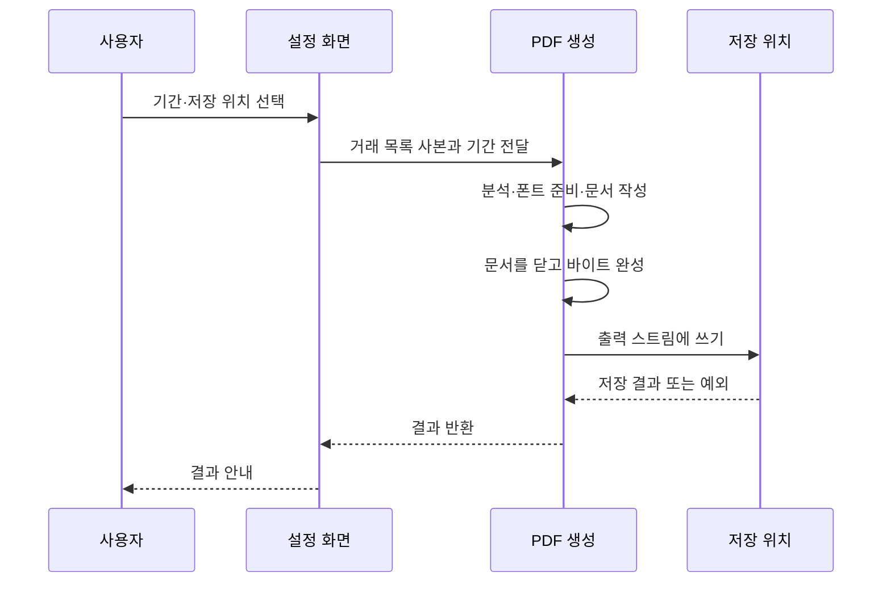

# 주식매매노트: 앱 구조와 리뷰에서 이어진 구현

2026-09-23 기준. 제가 직접 관리하는 앱의 현재 구조를 기능과 책임 중심으로 정리했습니다. 전체 소스 대신 리뷰와 연결되는 구현 패턴을 설명합니다.

## 1. 개발 환경과 기술 선택

| 영역 | 현재 구성 | 앱에서 맡는 역할 |
|---|---|---|
| 언어·UI | Kotlin, Jetpack Compose, Material 3 | 거래 입력·목록·가이드·설정 화면 |
| 화면 이동 | Navigation Compose | 주요 화면 간 이동 |
| 상태 관리 | ViewModel, Compose State, Kotlin Coroutines / Flow | DB 변경 구독, 입력·화면 상태 전달 |
| 로컬 저장 | Room, KSP | 거래 기록 조회·저장 |
| 설정 저장 | SharedPreferences | 사용자 선택과 표시 설정 보관 |
| 분석 | Kotlin 계산 로직 | 거래 이력에서 손익·기간별 분석 결과 생성 |
| PDF | iText, Android 문서 저장 API | 분석 결과를 문서로 만들고 선택한 위치에 저장 |
| 백업 | Gson, JSON, ZIP | 거래·설정·즐겨찾기 내보내기와 복원 |
| 빌드 | Gradle Kotlin DSL, R8 | Android 빌드와 릴리스 최적화 |
| 빌드 기준 | minSdk 24 / compileSdk·targetSdk 36 / JVM target 11 | 현재 프로젝트 설정 기준. 배포된 모든 버전의 설정을 뜻하지 않음 |

앱의 패키지 식별자, 서명 설정, 광고 식별자, DB 스키마, 백업 내부 키는 이 문서에 담지 않았습니다.

## 2. 현재 구조를 기능 단위로 보기



이 그림은 기능 관계를 단순화한 현재 구조입니다. ViewModel이 DAO를 직접 사용하고, 일부 화면은 분석·내보내기 유틸리티를 호출합니다. 모든 처리가 Repository와 UseCase를 거치는 구조라고 표현하지 않았습니다. 앞으로 기능이 커지면 내보내기와 복원처럼 책임이 큰 작업을 더 분리할 여지가 있습니다.

```text
화면 계층       홈 / 거래 입력·목록 / 캘린더 / 리포트 / 가이드 / 설정
상태·작업       ViewModel / Compose State / 코루틴
데이터          거래 모델 / Room DAO / 설정 저장
분석·출력       손익 분석 / 기간 집계 / PDF / 백업 / CSV
리소스          테마 / 문자열 / 가이드 언어 처리
```

## 3. 코드 예제의 범위

아래 예제는 현재 소스에서 확인한 패턴을 **이름과 세부 구조를 바꿔 설명용으로 재구성**했습니다. 전체 원본이나 그대로 빌드되는 독립 앱이 아닙니다. 핵심 손익 산식과 내부 데이터 구조는 제외했습니다. 제안하는 설계와 실제 구현을 혼동하지 않도록 각 예제의 목적을 함께 적었습니다.

### A. 등록된 종목으로 자동완성

같은 종목을 반복 입력하는 부담을 줄여 달라는 리뷰에서 이어진 기능입니다. 현재는 등록된 이름에서 공백을 정리한 검색어를 찾고, 시작 부분이 일치하는 후보를 우선 표시합니다.

```kotlin
fun suggestions(input: String, registered: List<String>): List<String> {
    if (input.isBlank()) return emptyList()
    fun normalize(value: String) =
        value.replace("\\s".toRegex(), "").lowercase()

    val query = normalize(input)
    return registered.asSequence()
        .filter { normalize(it).contains(query) }
        .sortedByDescending { it.startsWith(input, ignoreCase = true) }
        .take(5)
        .toList()
}
```

별도의 종목 검색 서비스 전체를 공개하지 않고도, 기존 기록을 다음 입력에 활용하는 방법을 보여줄 수 있는 부분입니다.

### B. 입력 자릿수와 화면 표시를 구분

소수점 수량 입력 요청을 받고 입력부에서 허용하는 소수부를 6자리로 늘렸습니다. 아래는 입력 처리 중 자릿수 제한만 추린 예제입니다.

```kotlin
// 숫자와 소수점 하나만 남긴 문자열이라는 전제
val parts = cleanedInput.split('.')
val integerPart = parts[0]
val fraction = parts.getOrElse(1) { "" }.take(6)
val inputText = if ('.' in cleanedInput) {
    "$integerPart.$fraction"
} else integerPart
```

저장할 입력값과 화면에서 읽기 좋게 표시하는 문자열을 구분하는 것이 핵심입니다. 현재 거래 모델의 숫자는 Double 기반이므로, 소수점 6자리 입력 지원을 십진수의 무오차 저장 보장으로 표현하지 않았습니다. 위 코드는 전체 입력 검증기나 수치 타입 개선안이 아닙니다.

### C. 홈에서 종목의 거래와 메모를 다시 찾기

홈의 요약만으로 부족하다는 요청에 따라 종목을 선택해 거래 날짜와 메모를 확인하는 흐름이 있습니다.

```kotlin
val history = records
    .filter { it.assetLabel == selectedLabel && it.time <= now }
    .sortedByDescending { it.time }

val recentNotes = history
    .map { it.note }
    .filter { it.isNotBlank() }
    .distinct()
    .take(3)
```

거래 목록에서는 메모가 있는 행에 메모를 함께 표시합니다.

```kotlin
if (row.note.isNotBlank()) {
    Text(text = row.note)
}
```

정보를 입력하는 기능에 더해, 나중에 매매 이유를 다시 찾는 접근성을 개선한 사례입니다.

### D. 종목 색상 선택과 저장

색상 변경 요청은 화면의 일시적인 색 변경만으로 끝나지 않습니다. 다시 열었을 때도 선택이 이어지도록 상태 갱신과 저장을 연결합니다.

```kotlin
fun changeAssetColor(label: String, colorIndex: Int) {
    selectedColors[label] = colorIndex
    persistColorSelection(selectedColors)
}
```

현재 앱은 종목별 색상 선택을 상태에 반영하고 설정에 저장합니다. 저장 키와 직렬화 형식은 예제에서 생략했습니다.

### E. DB 변경을 화면 상태로 전달

현재 ViewModel은 DAO의 Flow를 구독해 거래 목록을 갱신합니다. 아래는 그 관계만 나타낸 예제입니다.

```kotlin
viewModelScope.launch {
    dao.observeEntries().collect { entries ->
        visibleEntries.clear()
        visibleEntries.addAll(entries)
    }
}
```

입력·편집으로 DB가 바뀌면 목록 상태가 갱신되는 흐름입니다. 이 짧은 예제가 동시성이나 모든 화면의 상태 일관성을 단독으로 보장하지는 않습니다.

### F. 홈의 표시 개수와 분석 데이터 분리

거래가 늘수록 홈이 길어지는 문제는 최근 10개 표시와 접기·펼치기로 조정했습니다. 이때 분석에 사용하는 이력까지 줄이면 안 됩니다.

```kotlin
val recentRows = orderedHistory.take(10)

if (expanded) {
    recentRows.forEach { TransactionRow(it) }
}
// 손익 분석에는 필요한 전체 이력을 전달
val summary = analyze(allRecords)
```

### G. 보유 자산과 실현손익을 분리

실현손익 제목 아래 보유 원금이 보였던 문제는 화면에 연결한 데이터의 의미부터 다시 확인했습니다.



```kotlin
// 기존 원가 계산의 결과를 재사용. 핵심 산식은 제외.
val byAsset = completedSales.groupBy { it.assetLabel }
val rows = byAsset.map { (label, sales) ->
    ProfitRow(label, sales.sumOf { it.realizedProfit })
}.sortedByDescending { it.profit }
```

연간 차트에는 연도 선택과 1~12월 표시가 있습니다. 과거 거래가 매도 원가에 영향을 줄 수 있으므로, 화면 기간을 선택한다는 이유로 원가 계산에 필요한 과거 이력을 먼저 버리지 않는 점도 중요하게 살펴봤습니다.

### H. PDF 생성과 저장 단계



```kotlin
val snapshot = records.toList()
val bytes = ByteArrayOutputStream().use { buffer ->
    buildAndClosePdf(buffer, snapshot)
    buffer.toByteArray()
}

resolver.openOutputStream(destination, "wt")?.use { output ->
    output.write(bytes)
    output.flush()
}
```

현재 구현에서 확인되는 생성·저장 분리 패턴입니다. 메모리 버퍼에는 문서 크기만큼 비용이 들고, 출력 스트림 열기 실패와 닫기 실패도 고려해야 합니다. 설명을 위해 생략한 오류 처리까지 이 코드가 해결한다는 뜻은 아닙니다.

### I. 긴 용어를 항목 단위로 줄바꿈

```kotlin
FlowRow(
    horizontalArrangement = Arrangement.spacedBy(8.dp),
    verticalArrangement = Arrangement.spacedBy(8.dp)
) {
    terms.forEach { term -> ConceptChip(term) }
}
```

긴 용어가 좁은 가로 공간에 눌리는 문제에 대응했습니다. 카드로 추천 주제를 묶고, 일부 고정 문구를 `stringResource`로 바꾸는 작업도 함께 진행했습니다.

## 4. 제가 확인하고 기록하는 기준

리뷰를 받은 날짜, 답변에서 약속한 내용, 현재 코드에 반영된 내용, 실제 기기에서 확인한 결과를 구분합니다. 이번 문서 정리 과정에서는 새로운 빌드나 기기 테스트를 실행하지 않았으며, 과거 대화의 빌드 성공을 새로운 검증 결과로 옮겨 쓰지 않았습니다.

핵심은 기능 목록을 늘리는 것뿐 아니라 사용자가 제보한 불편이 어떤 데이터 흐름과 화면 동작에 연결되는지 이해하고, 수정 뒤 다시 확인하는 과정입니다.

[리뷰에 따른 수정 과정](REVIEW_DRIVEN_IMPROVEMENTS.md) · [처음으로](README.md)
