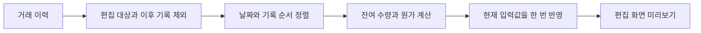
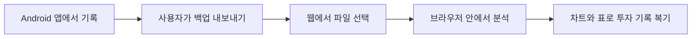

# 개발 기록 #5 — 리뷰에서 발견한 계산 문제와 투자 가이드 개선

2026-10-02 · [공식 홈페이지](https://tradingnote.kr/) · [이전 리뷰 개선 기록](REVIEW_DRIVEN_IMPROVEMENTS.md)

## 계속 운영하면서 달라진 점

주식매매노트를 직접 사용하기 위해 만들기 시작했지만, 이제는 사용자들이 남겨 주는 리뷰가 다음 작업의 출발점이 되고 있습니다. 종목 자동완성, 소수점 입력, 메모 접근성, 투자 리포트에 이어 이번에는 **전량 매도 후 재매수했을 때의 평단 표시**를 점검했습니다.

처음에는 홈 화면의 값이 정상이라 문제를 바로 확인하지 못했습니다. 다시 거래를 수정하는 흐름을 따라가자 편집 화면의 ‘매수 후 평단’ 미리보기에 이전 매수 이력이 섞이는 현상을 확인했습니다. 같은 종목을 보여 주더라도 화면마다 어떤 시점의 데이터를 계산하는지 확인해야 했습니다.

이번 기록은 제가 AI 코딩 도구의 도움을 받아 수정하고, 계산 테스트와 빌드 결과를 확인한 과정입니다. 코드는 공개에 적합하도록 일반화한 짧은 설명용 예제이며 앱 원본 전체나 실제 사용자 데이터는 아닙니다.

## 1. 리뷰를 재현 가능한 문제로 바꾸기

리뷰의 요지는 “이미 매도하고 새로 샀는데 단가가 이상하다”였습니다. 작성자 이름과 기기 식별 정보는 공개하지 않습니다.

| 확인 순서 | 확인 내용 |
|---|---|
| 홈 확인 | 현재 보유 자산의 평단은 정상으로 보였습니다. |
| 편집 진입 | 거래 편집의 매수 후 평단 미리보기에서 차이를 확인했습니다. |
| 입력 이력 점검 | 매도에 따라 줄어든 보유 원가와 편집 시점의 구분이 필요했습니다. |
| 수정 범위 결정 | 거래 입력·편집 미리보기 계산에 범위를 한정했습니다. |

### 가상 거래로 이해하기

1. 10주를 주당 10,000원에 매수합니다.
2. 10주 전량을 매도합니다.
3. 5주를 주당 20,000원에 다시 매수합니다.

새로 보유한 5주의 평단은 20,000원이어야 합니다. 과거 매수까지 단순히 더하면 200,000원 ÷ 15주 = 약 13,333원이 되어, 이미 매도한 원가가 다시 섞입니다. 이 숫자는 문제 원리를 설명하기 위한 가상 예시입니다.

### 전후 계산 관점

```kotlin
// 이전 문제를 단순화한 예: 전체 매수만 합산
val buys = history.filter { it.isBuy }
val average = buys.sumOf { it.quantity * it.price } /
    buys.sumOf { it.quantity }
```

수정 후에는 **남아 있는 수량과 원가**를 거래 순서대로 추적합니다.

```kotlin
// 설명용 예제: 유효한 매매 수량, 동일 통화라는 가정
when (trade.side) {
    BUY -> {
        quantity += trade.quantity
        cost += trade.quantity * trade.price
    }
    SELL -> {
        val average = if (quantity > 0) cost / quantity else 0.0
        quantity -= trade.quantity
        cost = if (quantity == 0.0) 0.0 else quantity * average
    }
}
```

위 코드는 개념 설명만 담았습니다. 실제 수정에는 소수 수량의 잔여 오차 처리와 기존 통화 환산 규칙을 유지하는 처리가 포함됩니다. 수수료·세금까지 포함한 범용 투자 계산 엔진 예제가 아닙니다.

편집 화면에서는 다음 두 가지도 구분했습니다.

- 수정 중인 원래 거래를 미리보기 입력에 다시 포함하지 않습니다.
- 편집 시점 이후의 거래를 제외합니다. 같은 시각이면 일관된 기록 순서를 사용합니다.



미리보기 계산은 결과를 화면에 반환하며 저장된 거래를 수정하지 않습니다. 기존 홈 통계나 DB 구조까지 넓게 바꾸지 않고, 확인된 문제에 집중했습니다.

## 2. 계산을 반복 확인할 수 있게 만들기

계산 미리보기의 회귀 테스트 8개가 통과했습니다.

| 테스트 | 확인한 기대 결과 |
|---|---|
| 전량 매도 후 재매수 | 새 매수 원가로 평단 시작 |
| 재매수 기록 편집 | 원래 기록·이후 기록 제외, 입력 이력 불변 |
| 일부 매도 후 추가 매수 | 남은 원가에 신규 매수 반영 |
| 재매수 후 매도 미리보기 | 새 보유 원가 기준 예상 손익 |
| 같은 시각의 거래 | 기록 순서에 따른 일관된 계산 |
| 과거 날짜의 신규 거래 | 미래 거래·다른 종목 제외 |
| 달러 거래 | 기존 현재 환율 환산 방식 유지 |
| 소수점 여섯 자리 잔여 수량 | 작은 실제 보유 수량 보존 |

대표 검증을 설명용으로 줄이면 다음과 같습니다.

```kotlin
// 10,000원에 10주 매수 → 전량 매도 → 20,000원에 5주 재매수
assertEquals(20_000.0, rebuyPreview.average, 0.000001)

// 10,000원에 10주 매수 → 5주 매도 → 20,000원에 5주 추가 매수
assertEquals(15_000.0, partialSalePreview.average, 0.000001)
```

기본 테스트 1개를 포함한 디버그 단위 테스트와 디버그·릴리스 APK 빌드가 통과했습니다. 계산 수정은 직접 사용하면서 정상 표시도 확인했습니다. 이 결과를 모든 기기·모든 기능의 검증 완료로 확대해서 해석하지는 않습니다.

## 3. 투자 가이드: 뜻을 읽고, 예시로 이해하고, 오해를 점검하기

리뷰에 대응하는 작업과 함께 투자 가이드의 설명량과 화면 구성을 개선했습니다. 이 부분은 이번 평단 리뷰의 직접 요청 사항이 아니라, 제가 앱을 운영하며 함께 개선한 사용성 작업입니다.

기존 **76개 한국어 항목**의 핵심 뜻·쉬운 예시·주의점 본문을 보강했습니다. 해당 본문의 전체 분량은 약 **2.3배**로 늘렸습니다. 같은 문장을 반복하기보다 계산 예시와 해석 시 주의할 조건을 추가했습니다. 다른 언어의 모든 번역을 확장한 것은 아닙니다.

### 예: 배당수익률을 이해하는 방식

- 핵심 뜻: 배당금과 주가의 관계를 설명합니다.
- 쉬운 예시: 가상의 주가와 연간 배당금을 이용해 비율을 계산합니다.
- 오해 점검: 수익률이 높아 보이는 이유가 배당 증가인지 주가 하락인지 구분합니다.
- 추가 질문: 배당의 지속 가능성과 관련 개념을 함께 살펴보도록 구성합니다.

### 화면 구성

| 영역 | 변경 방향 |
|---|---|
| 상단 헤더 | 네이비에서 블루로 이어지는 그라데이션 |
| 탭 | 선택 상태가 구분되는 둥근 탭 |
| 목록 카드 | 은은한 색상·테두리·설명 미리보기 |
| 상세 설명 | 뜻·예시·주의점마다 색상과 아이콘으로 구분 |
| 생각해 볼 질문 | 별도 배경과 테두리가 있는 카드 |
| 관련 용어 | 긴 문구가 다음 줄로 흐르는 버튼 배치 |
| 더 알아보기 | 펼침 상태와 경계가 분명한 영역 |

```kotlin
// Jetpack Compose 설명용 예제: 본문 카드의 계층 구분
Surface(
    color = accent.copy(alpha = 0.07f)
        .compositeOver(MaterialTheme.colorScheme.surface),
    border = BorderStroke(1.dp, accent.copy(alpha = 0.22f)),
    shape = RoundedCornerShape(20.dp)
) {
    Column(Modifier.padding(20.dp)) {
        Text(sectionTitle, style = MaterialTheme.typography.titleMedium)
        Spacer(Modifier.height(12.dp))
        Text(sectionBody, style = MaterialTheme.typography.bodyLarge)
    }
}
```

```kotlin
// 긴 관련 용어를 가로 한 줄에 억지로 넣지 않기
FlowRow(
    horizontalArrangement = Arrangement.spacedBy(8.dp),
    verticalArrangement = Arrangement.spacedBy(8.dp)
) {
    relatedTerms.forEach { term -> RelatedTermChip(term) }
}
```

기존 항목 ID와 관련 용어 연결은 유지했습니다. 즐겨찾기의 기준이 되는 ID를 디자인 변경 때문에 새로 만들지 않았습니다. 변경 전 가이드 파일을 별도로 백업해, 원래 디자인으로 되돌릴 수 있게 했습니다.

## 4. 모바일 기록을 웹에서도 복기하기

공식 홈페이지 **[tradingnote.kr](https://tradingnote.kr/)**도 함께 운영하고 있습니다.

앱에서 내보낸 백업을 브라우저에서 읽고 월별 손익·보유 원가 비중·상세표 등을 PC에서 살펴볼 수 있도록 구성했습니다. 현재 방식은 **백업 파일을 직접 가져오는 방식**이며, 계정 기반 실시간 자동 동기화는 아닙니다.



웹 제작 과정과 가상 데이터 기반 예제는 [웹 제작 기록](website-showcase/README.md)에 따로 정리했습니다. 실제 사용자 백업이나 운영 서비스 전체 소스는 공개하지 않았습니다.

## 이번에 남긴 운영 원칙

1. “제 화면에서는 정상”에서 끝내지 않고 사용자가 거친 화면 순서를 따라갑니다.
2. 전체 통계와 편집 미리보기처럼 비슷해 보이는 값도 계산 시점을 구분합니다.
3. 문제가 확인된 범위부터 수정하고 재현 사례를 테스트로 남깁니다.
4. 콘텐츠와 디자인을 바꾸더라도 기존 즐겨찾기 연결과 되돌릴 방법을 보존합니다.
5. 빌드 성공, 자동 계산 테스트, 직접 사용 확인을 구분해서 기록합니다.

500+ 다운로드를 기록한 뒤에도 목표는 같습니다. 숫자만 늘리는 것보다 실제로 사용 중인 앱을 계속 읽고, 고치고, 관리하는 경험을 쌓아 가려고 합니다.

---
공개 범위: 리뷰는 익명으로 요약했으며, 코드는 학습용으로 축약했습니다. 내부 저장 구조·전체 계산 엔진·서명 및 인증 정보·실제 투자 기록은 포함하지 않았습니다. 이 문서는 수정 및 검증 기록이며 Google Play 심사나 배포 완료를 뜻하지 않습니다.

