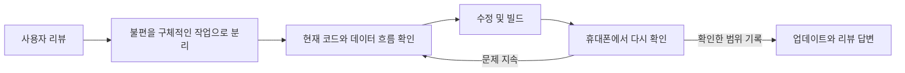

# 사용자 리뷰에서 시작한 주식매매노트 개선

기록일: 2026-09-23 · Android / Kotlin / Jetpack Compose / PDF

## 한눈에 보기

실제 사용자 리뷰에서 PDF 내보내기 실패와 종목별 실현손익 표시 오류를 접수했습니다. 두 문제를 분리해 살펴보고, 데이터 연결 수정과 PDF 생성·저장 경로 보강을 진행했습니다. 이후 투자 가이드의 긴 텍스트 배치, 일부 번역 누락, 거래 목록 구분선도 함께 개선했습니다.

저는 주식매매노트를 직접 개발하고 관리하면서 사용자 리뷰를 다음 개선 작업의 출발점으로 삼고 있습니다. 이번 글은 제가 남긴 리뷰 답변과 수정 대화, 이전 소스 스냅샷, 현재 코드를 함께 살펴 정리한 기록입니다. 현재 제보된 오류에 대한 수정은 마친 상태입니다. 다만 코드에 반영한 내용과 실제 기기에서 확인한 범위를 구분해 기록하려고 합니다.

## 사용자 리뷰가 쌓이면서 바뀐 개선 우선순위

아래는 지금까지 받은 일곱 건의 리뷰를 개인정보 없이 요약한 기록입니다. 리뷰를 남긴 날짜와 실제 배포 날짜를 혼동하지 않도록, 답변 당시 약속과 현재 코드에서 확인한 기능을 나눴습니다.

| 리뷰 날짜 | 의견 요약 | 제가 한 대응과 현재 확인되는 내용 |
|---|---|---|
| 2026-05-22 | 연도별 리포트와 전체 기간 통계 요청 | 다음 날 개선 검토를 답변했습니다. 현재 연도 선택과 연간 차트가 있습니다. 전체 기간 요청을 모두 충족한 별도 화면까지 완료했다고 단정하지는 않습니다. |
| 2026-05-24 | 주식 기록에 자주 사용한다는 의견 | 감사 인사를 전했습니다. 새 기능 요청이 없는 긍정 리뷰도 기존 사용 흐름을 유지할 이유로 받아들였습니다. |
| 2026-06-05 | 기존 종목명을 매수·매도 입력에 자동완성해 달라는 요청 | 6월 7일 반영 예정임을 답변했습니다. 현재 등록된 종목명을 검색해 후보를 보여주는 기능이 있습니다. |
| 2026-06-24 | 수량의 소수점 입력을 3자리에서 6자리로 확대 요청 | 같은 날 입력 범위를 확장했다고 답변했습니다. 현재 입력 처리에 6자리 제한이 반영되어 있습니다. 당시 안내한 표시 반올림과 입력값 보존은 구분해야 하며, 숫자 저장 타입의 정밀도까지 무제한 보장하는 뜻은 아닙니다. |
| 2026-07-02 | 종목 색상 변경, 홈에서 거래·메모 확인, 거래 목록 메모 표시 요청 | 세 항목을 구체적으로 정리해 순차 반영을 답변했습니다. 현재 색상 변경, 홈 종목 상세의 거래 날짜·메모, 거래 행의 메모 표시가 코드에 있습니다. |
| 2026-07-03 | 디자인과 다양한 기능에 대한 긍정 의견 | 감사 인사를 전했습니다. 이후 개선에서도 기록하기 쉬운 화면과 익숙한 기능 접근을 중요하게 봤습니다. |
| 2026-09-21 | PDF 생성 실패와 종목별 실현손익 표시 오류 제보 | 9월 22일 문제 확인과 수정 예정일을 답변했습니다. 이후 기기 재확인과 추가 수정을 반복했고, 이번 글에 그 과정을 남겼습니다. |

정확한 과거 배포 시각을 증명하는 기록이 없는 항목에는 임의의 완료일을 붙이지 않았습니다. 현재 코드에서 기능을 찾았다는 사실은 그 리뷰 직후 배포됐다는 증거와는 다릅니다.

작은 입력 편의 요청에서 시작해, 기록을 다시 찾는 방법과 보고서의 신뢰성으로 관심 범위가 넓어졌습니다. 저는 이 흐름을 보면서 **입력 → 조회 → 분석 → 내보내기** 전체를 사용자가 이어서 경험한다는 점을 더 분명하게 이해하게 됐습니다.



앱의 기술 구조와 더 많은 코드 예제는 [구조·개발 환경·구현 패턴](ARCHITECTURE_AND_CODE.md)에 따로 정리했습니다.

## 1. 리뷰를 개발 과제로 바꾸기

리뷰 요약: PDF 투자 보고서가 생성되지 않으며, 종목별 실현손익 목록에 현재 보유 종목과 매수 금액처럼 보이는 값이 나온다는 제보였습니다. 작성자의 이름·사진·기기 식별 정보와 원본 캡처는 공개 자료에서 제외했습니다.

| 사용자 증상 | 분리한 과제 | 확인할 결과 |
|---|---|---|
| PDF 생성 실패 | 생성과 저장의 실패 지점 구분 | 파일이 저장되고 본문·한글·차트가 읽히는지 |
| 실현손익 목록의 의미가 다름 | 화면 제목과 연결된 데이터 비교 | 매도한 거래의 확정 손익이 표시되는지 |
| 긴 가이드 용어의 줄바꿈 | 가로 배치의 폭 제약 검토 | 좁은 화면에서도 용어를 읽을 수 있는지 |
| 언어 변경 후 한국어 잔존 | 고정 문구와 번역 경로 검토 | 선택한 언어에 맞는 문구가 나타나는지 |
| 거래 사이 구분선이 불규칙 | 그리기 좌표와 대비 검토 | 각 행 사이에 선이 일관되게 보이는지 |

리뷰에는 문제 확인과 수정 예정 사실을 답변했습니다. 이 저장소에는 실제 답변을 새로 게시하거나 과거 답변을 수정하지 않고, 대응 과정을 요약했습니다.

## 2. 한 번의 수정으로 끝나지 않았던 과정

1. **증상 분리:** 보고서 화면의 잘못된 값과 PDF 파일 생성 실패를 별도 문제로 다뤘습니다.
2. **데이터 연결 추적:** 이전 소스에서 실현손익 영역이 보유 자산 목록에 연결된 것을 확인했습니다. 매도 분석 결과를 종목별로 묶고 화면이 그 결과를 사용하도록 바꿨습니다.
3. **PDF 초기 접근:** 시스템 폰트 탐색 범위와 인코딩 처리를 보강했습니다. 개발 대화에서는 빌드 성공이 보고됐지만, 제가 휴대폰에서 다시 확인했을 때 여전히 실패해 추가 수정을 요청했습니다.
4. **해결 범위 재설정:** 폰트만 원인이라고 단정하지 않고 문서 생성, 저장 스트림, 실행 환경, 릴리스 난독화 설정까지 점검 범위를 넓혔습니다. 내장 폰트 추가 방안도 논의됐지만 최종 기록은 현재 소스에 존재하는 구현을 기준으로 삼았습니다.
5. **생성과 저장 분리:** 메모리에서 PDF를 완성한 뒤 목적지에 저장하는 구조, 쓰기 모드 명시, 입력 목록 사본 전달, 섹션별 예외 처리와 로그를 반영했습니다.
6. **주변 UX 개선:** 가이드 배치·일부 번역·거래 구분선을 정리했습니다.
7. **결과 기록:** 제가 진행한 수정과 실제 소스 반영을 기록하되, 컴파일 성공을 모든 기기의 정상 동작 증거로 사용하지 않았습니다.

이 순서는 제가 남긴 수정 대화의 흐름입니다. 각 시도를 실제 과거 Git 커밋처럼 만들거나 정확하지 않은 작업 시각을 붙이지 않았습니다.

## 3. 실현손익: 값의 계산보다 먼저 데이터의 의미 확인

이전 스냅샷에서는 실현손익 영역이 보유 목록을 순회했습니다. 현재 소스에서는 매도 분석 결과를 종목별로 합산한 목록을 화면에 연결합니다. 여기서 확인한 수정은 앱의 종목별 목록 연결이며, PDF의 모든 표가 같은 구성으로 변경됐다는 의미는 아닙니다.

예를 들어 가상 거래에서 매수 원금이 100이고 매도 금액이 120이면, 비용을 제외한 단순 설명상 실현손익은 20입니다. 보유 원금 100을 실현손익 제목 아래 표시하면 숫자 자체가 유효해도 화면이 전달하는 의미는 잘못됩니다.

아래 코드는 **실제 변경 방향을 이름과 구조를 바꿔 축약한 설명용 예제**입니다. 앱 원본 diff나 전체 손익 계산 엔진이 아닙니다.

```kotlin
// Before: 실현손익 영역에 보유 원금 연결
holdings.forEach { row ->
    showProfit(row.label, row.purchaseCost)
}

// After: 이미 계산된 매도 손익을 종목별로 합산
val realizedByAsset = completedSales
    .groupBy { it.assetLabel }
    .mapValues { (_, sales) -> sales.sumOf { it.realizedProfit } }

realizedByAsset.forEach { (label, profit) ->
    showProfit(label, profit)
}
```

핵심은 기존 원가·수수료 계산을 화면에서 다시 구현하는 대신, 의미에 맞는 분석 결과를 연결하는 것입니다. 이 예제는 통화 환산이나 원가 계산의 정확성을 검증하는 테스트는 아닙니다.

## 4. PDF: 생성과 저장을 분리하고 실패 지점을 좁히기

이전 스냅샷은 목적지 스트림을 먼저 열어 PDF를 작성했습니다. 현재 소스에는 메모리 버퍼에서 문서를 닫아 완성한 뒤 목적지에 쓰는 흐름이 있습니다. 또한 시스템 폰트 탐색·유니코드 인코딩 처리, 일부 섹션별 예외 처리, 관련 라이브러리 보호 규칙이 추가됐습니다.

```kotlin
// Before: 목적지 스트림에 생성 과정을 직접 연결
openDestination(uri)?.use { output ->
    renderDocument(output, records)
}

// After: 생성과 최종 저장을 분리한 개념 예제
val snapshot = records.toList()
val bytes = ByteArrayOutputStream().use { buffer ->
    renderAndCloseDocument(buffer, snapshot)
    buffer.toByteArray()
}
openDestination(uri, mode = "wt")?.use { output ->
    output.write(bytes)
    output.flush()
}
```

예제의 함수는 설명용이며 그대로 실행하는 완성 코드가 아닙니다. 실제 구현의 성공·실패 반환과 로그 등은 생략했습니다.

### 선택의 이유와 비용

- **메모리 버퍼:** 생성 단계와 저장 단계를 나눠 문제 위치를 구분하기 쉽습니다. 대신 문서 전체 바이트를 메모리에 보관하므로 큰 문서의 메모리 사용량은 별도로 살펴봐야 합니다.
- **입력 사본:** 생성 도중 목록 구조가 바뀌는 영향을 줄입니다. `toList()`는 깊은 복사나 DB 전체의 원자적 스냅샷을 의미하지 않습니다.
- **쓰기 모드 명시:** 저장 의도를 분명히 합니다. `wt`가 모든 저장 제공자에서 성공을 보장하거나 Android 특정 버전의 필수 조건이라는 뜻은 아닙니다.
- **섹션별 예외 처리:** 일부 섹션 실패의 전파를 제한하려는 선택입니다. 파일 생성 성공만으로 모든 내용이 포함됐다고 판단할 수 없으므로 결과 문서 확인이 필요합니다.
- **폰트·릴리스 설정:** 환경별 차이를 줄이기 위한 보강입니다. 남겨 둔 기록만으로 최초 장애의 단일 원인을 폰트 또는 난독화로 확정하지 않습니다.

## 5. 투자 가이드와 언어·목록 배치 개선

긴 개념을 한 줄에 밀어 넣는 배치에서, 공간이 부족하면 다음 줄로 항목이 넘어가는 배치로 바꿨습니다. 추천 주제를 카드 형태로 묶어 탐색 단위를 분명하게 했습니다.

```kotlin
// Before
Row { concepts.forEach { ConceptChip(it) } }

// After: 개념 칩 단위로 다음 줄에 배치
FlowRow(
    horizontalArrangement = Arrangement.spacedBy(8.dp),
    verticalArrangement = Arrangement.spacedBy(8.dp)
) {
    concepts.forEach { ConceptChip(it) }
}
```

설정의 일부 고정 문구는 리소스 참조로 변경했습니다. 가이드 주요 용어 설명에는 추가 언어 분기가 확인됩니다. 전체 콘텐츠가 모든 언어로 완역됐다는 의미는 아닙니다.

```kotlin
// 고정 문구 대신 현재 언어의 리소스 사용
Text(stringResource(R.string.export_action))
```

거래 구분선은 행 바깥 경계가 아닌 선 두께의 절반만큼 안쪽에 그리도록 조정했습니다.

```kotlin
val stroke = 1.dp.toPx()
val y = size.height - stroke / 2
drawLine(color, Offset(inset, y), Offset(size.width - inset, y), stroke)
```

모든 예제는 일반화한 짧은 패턴입니다. 화면 전체 디자인, 계산 엔진, 데이터 구조는 포함하지 않았습니다.

## 6. 검증 증거를 구분하기

| 근거 | 이번 기록에서 말할 수 있는 것 | 말할 수 없는 것 |
|---|---|---|
| 이전 스냅샷과 현재 코드 비교 | 보유 목록 연결 → 매도 손익 목록 연결, 직접 저장 → 버퍼 생성 후 저장 변경 | 모든 입력의 계산 정확성 |
| 현재 코드 확인 | FlowRow, 리소스 문구, 구분선 좌표, 릴리스 보호 규칙 반영 | 모든 화면 크기·언어·기기에서 정상 |
| 수정 대화와 기기 재확인 기록 | 빌드 성공 안내 뒤에도 제가 휴대폰에서 실패를 확인해 다시 수정을 진행함 | 빌드 성공만으로 실기기 검증 완료 |
| 현재 작업 상태 | 제보된 오류에 대한 수정 작업을 마침 | 모든 기기·입력·저장 위치에서 검증 완료 |

이번 문서화 작업에서는 앱 빌드와 실기기 테스트를 새로 실행하지 않았습니다. 성능 개선율이나 성공률의 측정 자료가 없으므로 수치를 기재하지 않았습니다. 이전 기록의 빌드 결과도 이번 수정본의 검증 결과로 옮겨 쓰지 않았습니다.

향후 회귀 확인 기준은 다음과 같습니다. 이는 이번에 모두 실행했다는 목록이 아닙니다.

- 매수만 있는 종목, 전량 매도한 종목, 부분 매도·손실 거래의 표시 비교
- 같은 기간의 화면 요약과 PDF 수치 비교
- 실제 릴리스 앱에서 한글·긴 종목명·거래량이 많은 보고서를 저장하고 다시 열기
- 언어 전환, 큰 글자, 좁은 화면에서 가이드와 설정 문구 확인

## 7. 개발자로서의 역할과 배운 점

저는 리뷰를 읽고 우선순위를 정했으며, 휴대폰에서 결과를 확인하고 해결되지 않은 부분은 다시 수정하도록 범위를 좁혔습니다. Android Studio AI로 구현을 보조받고 Codex로 코드와 기록을 검토했습니다. 어떤 결과를 사용자에게 제공할지 판단하고, 수정 결과를 다시 확인하는 일은 제가 맡았습니다.

가장 큰 배움은 **빌드 성공과 사용자 문제 해결이 같은 단계가 아니라는 점**입니다. 사용자에게서 실패가 다시 보고되면 첫 가설을 고집하지 않고, 데이터·문서 생성·저장·배포 환경으로 범위를 나눠 살펴봐야 합니다. 또 화면 제목과 실제 데이터가 의미상 일치하는지 확인하는 일이 계산식 자체만큼 중요합니다.

앞으로도 **사용자의 증상을 구체적인 개발 과제로 나누고, 결과가 기대와 다르면 다시 확인해 수정 방향을 바꾸는 방식**으로 앱을 관리하려고 합니다.

## 공개 범위

원본 리뷰 캡처, 작성자 정보, 전체 앱 소스, 핵심 계산식, DB 스키마, 인증·서명 정보, 실제 거래 데이터, 내부 상세 PDF는 업로드하지 않았습니다. 현재 문서는 제한된 코드 예제와 개발 과정 설명만 담습니다.

[기존 개선 기록으로 돌아가기](README.md)
